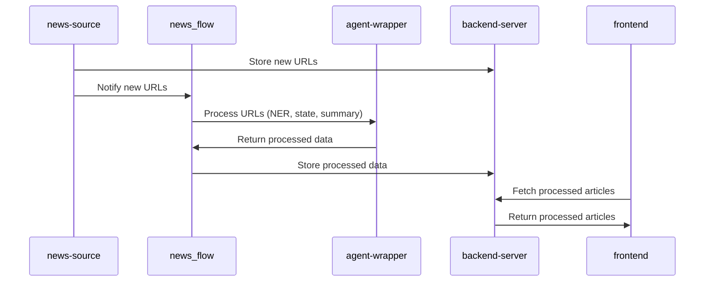

# News_Blog

A modular news blogging platform that periodically scrapes news sources, processes them for Named Entity Recognition (NER), state classification, and summary generation, and then displays them on a frontend. This project is composed of several components, each responsible for a specific part of the workflow.

---

## Table of Contents
1. [Overview](#overview)
2. [File Structure](#file-structure)
3. [System Flow Diagram](#system-flow-diagram)
4. [Setup Instructions](#setup-instructions)
    - [Prerequisites](#prerequisites)
    - [Installation and Running](#installation-and-running)
5. [How It Works](#how-it-works)
6. [License](#license)

---

## Overview

- **news-source**: Scrapes external news websites at fixed intervals, storing new URLs and notifying the `news_flow`.
- **news_flow**: Periodically checks for new URLs from `news-source`, invokes the `agent-wrapper` for additional processing (NER, state, summary).
- **agent-wrapper**: A Python module that interfaces with various NLP/LLM agents.
- **backend-server**: A Node.js server that interfaces with MongoDB to store and retrieve processed news data.
- **frontend**: A React application that displays the processed news articles to end users.

---

## File Structure

A high-level view of the repository:

```
News_Blog
├── agent-wrapper
│   └── agent_wrapper.py
├── backend-server
│   ├── .gitignore
│   ├── index.js
│   ├── netlify.toml
│   ├── package.json
│   ├── package-lock.json
│   ├── server.config.js
│   └── temp.txt
├── frontend
│   ├── public
│   ├── src
│   ├── .gitignore
│   ├── README.md
│   ├── package.json
│   └── package-lock.json
├── news-source
│   ├── .gitignore
│   ├── scrapper.config
│   ├── scrapper.py
│   ├── server.config
│   └── server.py
├── news_flow
│   ├── db
│   ├── src
│   ├── .gitignore
│   ├── README.md
│   ├── pyproject.toml
│   └── uv.lock
├── LICENSE
├── README.md
└── requirements.txt
```

---

## System Flow Diagram

```mermaid
flowchart LR
     A[news-source<br>(scraper)] -->|new URLs| B[backend-server + MongoDB]
     A -->|notify| C[news_flow<br>(invokes agent-wrapper)]
     C -->|processed data| B
     B --> D[frontend<br>(React App)]
```

- news-source scrapes news at fixed intervals and identifies new articles.
- news_flow receives notifications about new articles and uses agent-wrapper for NER, state classification, and summary generation.
- backend-server stores processed articles in MongoDB and serves them via an API.
- frontend fetches articles from backend-server and displays them.

---

## Setup Instructions

### Prerequisites

- Conda (for Python virtual environments)
- Python (3.12.9 recommended)
- Node.js (LTS version recommended)
- MongoDB (local or remote instance)

### Installation and Running

Clone the Git repository:

```bash
git clone https://github.com/prasanthreddylomada/News_Blog.git
cd News_Blog
```

Create and activate a Conda environment:

```bash
conda create -n NewsBlogPythonAll python=3.12.9
conda activate NewsBlogPythonAll
```

Install dependencies for the news source server and scraper:

```bash
pip install -r news-source/requirements.txt
```

Start the news source server (in the background if desired):

```bash
python news-source/server.py &
```

Install Node.js dependencies for the backend server:

```bash
cd backend-server
npm install
```

Start the backend server (in the background if desired):

```bash
node index.js &
```

Install frontend dependencies and start the frontend server:

```bash
cd ../frontend
npm install
npm start
```

(Optional) news_flow: Ensure you have the necessary Python dependencies (if any additional are needed), then run or schedule the news_flow scripts that listen for new URLs from news-source and process them.

---

## How It Works

- news-source scrapes external sources at a configurable interval (specified in scrapper.config) and checks for new articles.
- When new articles are found, they are stored in the backend (MongoDB) and the news_flow service is notified.
- news_flow calls the agent-wrapper, which performs:
  - Named Entity Recognition (NER)
  - State classification
  - Summary generation
- The processed data (with NER, state tags, and summaries) is then sent to the backend-server, which stores it in MongoDB.
- The frontend (React app) fetches the processed articles from the backend-server and displays them to users.

This modular approach allows each component to focus on a specific task while maintaining a clean, scalable architecture.

---

## How It Works Diagram


